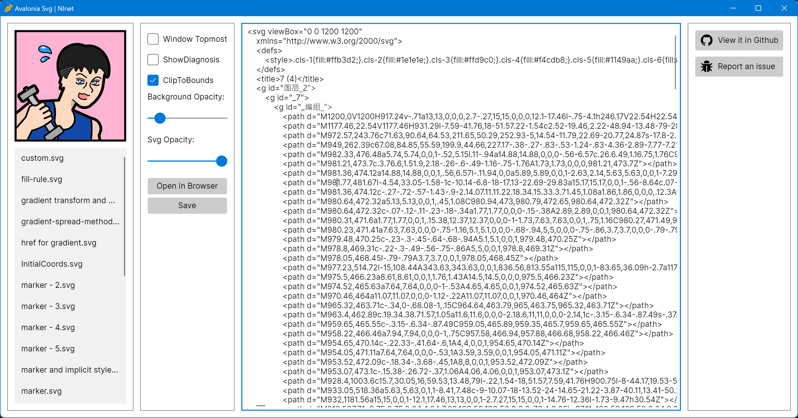

<div align="left">
  <a href="https://www.w3.org/TR/SVG2/">
    
  </a>
  <a href="https://github.com/microsoft/dotnet">
    
  </a>
  <a href="https://avaloniaui.net/">
    
  </a>
  <a href="https://dotnet.microsoft.com/zh-cn/languages/csharp">
    
  </a>
  <a href="http://www.gnu.org/licenses/mit.en.html">
    
  </a>
  <a href="https://www.cnblogs.com/liwuqingxin/">
    
  </a>
  <a href="https://github.com/liwuqingxin">
    
  </a>
</div>


# License

This library is distributed under the AGPL 3.0 license. See the [LICENSE](http://www.gnu.org/licenses/agpl-3.0.en.html) for more information.

# About

:notebook: **Avalonia.Svg** is a .net rendering engine for loading and displaying Scalable Vector Graphics (SVG) files in Avalonia applications. It provides a simple way to load and render SVG files as part of your UI.

:mortar_board: [**Avalonia**](https://avaloniaui.net/) is a cross-platform .net UI framework. 

:date: This library could be also available in **WPF** in future, not now.

:bell: Objects generated by this rendering engine are static and non-editable.

:cry: My English is not very well. Please forgive me if there are any mistakes in my expression.

:heart: Any suggestions and comments are **appreciated**. If you find a bug or would like to contribute to this library, please open an issue or submit a pull request on GitHub. 

# Using

- About nuget: Not available now.

- Using Icon control and it's IconSvg Property.

```Xaml
<controls:Icon Width="24"
               Height="24"
               IconSvg="avares://Nlnet.Avalonia.Svg.Sample/Assets/bug-fill.svg" />
```

- Using Icon control and it's IconSvgData Property.

```Xaml
<controls:Icon ClipToBounds="{Binding #ClipToBounds.IsChecked}"
               IconStretch="Uniform"
               IconSvg="avares://Nlnet.Avalonia.Svg.Sample/Assets/NLNet.svg"
               IconSvgData="{Binding Path=EditableSvgData}"
               IsHitTestVisible="False"
               Opacity="{Binding #SvgGroundOpacity.Value}"
               ShowDiagnosis="{Binding #ShowDiagnosis.IsChecked}" />
```

# SVG Viewer using it.





# Features

:white_check_mark: The **Avalonia.Svg** library supports a variety of features for loading and rendering SVG files, including:

- Loading SVG files from a svg data, svg file or a stream.
- ~~Resolving external resources (such as images) referenced in the SVG file.~~
- Applying transformations (such as scaling, rotation, and translation) to the SVG image.
- Setting the fill and stroke colors of the SVG image.
- Clipping the SVG image to a specific area.

:pensive: While the `Avalonia.Svg` library supports a wide range of SVG features, there are some limitations to be aware of:

- The library does not support all SVG elements and attributes. In particular, some advanced features (such as filters and masks) are not currently supported.

- **Animation** and some other external feature of SVG are not supported, like resolving external resources (such as images) referenced in the SVG file.
- Performance may be impacted when rendering complex SVG files with a large number of elements or gradients. We have not made any performance optimization about it till now.

:date: **Pattern**, **masker** and **mark** are coming soon.

### Document Structure

| Tag         | Support            |      |
| ----------- | ------------------ | ---- |
| svg         | :heavy_check_mark: |      |
| g           | :heavy_check_mark: |      |
| defs        | :heavy_check_mark: |      |
| symbol      | :x:                |      |
| use         | :heavy_check_mark: |      |
| switch      | :x:                |      |
| desc, title | :date:             |      |
| matadata    | :date:             |      |

### :heavy_check_mark: Styling

We have implemented the CSS style system for SVG. We support explicit style, implicit style with selectors and local setter to set property.

### :heavy_check_mark: Geometry Properties

We support all geometry properties include **cx, ry, r, rx, ry, x, y, width, height**.

### :heavy_check_mark: Coordinate Systems, Transformations and Units

We support **viewBox**, **transform** and **preserveAspectRatio** properties. Note that the viewBox and preserveAspectRatio is only available in svg tag now.

### :heavy_check_mark: Paths

Support it.

### :heavy_check_mark: Basic Shapes

We support all basic shapes include **rect, circle, ellipse, line, polyline, poligon**.

### :date: Text

Not yet.

### :x: Embedded Content

Not yet and no plan about it.

### :heavy_check_mark: Painting: Filling, Stroking and Marker Symbols

We have supported **fill, stroke**. :date: **Marker** is not supported yet.

### :heavy_check_mark: Paint Servers: Gradients and Patterns

We have supported **gradients**. :date: **Patterns** not yet.

### :x: Scripting and Interactivity

Not yet and no plan about it.

### :x: Linking

Not yet and no plan about it.

# Release Plan

The version 1.0.0 would come after the use and pattern being done. And then we will make a nuget package for developers.

# Q&A

None.
